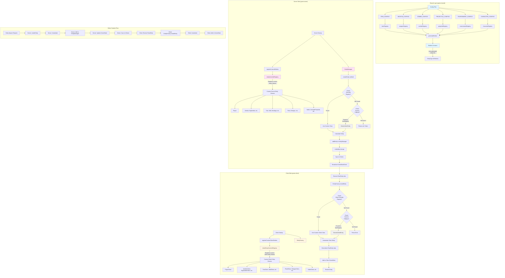

# Entity System Architecture Diagram

## Key Concepts

### 1. **Shared Configuration Layer**

- All entity configurations (items, weapons, zombies, etc.) are defined in `game-shared`
- Configs are registered into registries (itemRegistry, weaponRegistry, etc.)
- `generateEntities()` auto-generates the `Entities` constant from all registries
- This ensures adding a new config automatically makes it available everywhere

### 2. **Server Entity System**

- **Override Registry**: Maps entity types to custom server entity classes
- **EntityManager**: Creates and manages all server entities
- **Creation Flow**:
  1. Check `entityOverrideRegistry` for custom class
  2. If not found, check `itemRegistry` for generic fallback
  3. Instantiate entity and add to EntityManager
- **Custom Classes**: Player, Zombies, Items with custom behavior, Weapons, Projectiles
- **Generic Fallback**: `GenericItemEntity` for simple items without custom behavior

### 3. **Client Entity System**

- **Override Registry**: Maps entity types to custom client entity classes
- **EntityFactory**: Creates client entities from server data
- **Creation Flow**:
  1. Receive `RawEntity` data from server
  2. Check `clientEntityOverrideRegistry` for custom class
  3. If not found, check `itemRegistry` for generic fallback
  4. Instantiate client entity and deserialize data
- **Custom Classes**: Client versions of all server entities (PlayerClient, ZombieClient, etc.)
- **Generic Fallback**: `GenericClientEntity` for simple items

### 4. **Entity Synchronization**

- Server maintains authoritative entity state
- Server broadcasts `GameStateEvent` with entity data
- Client receives `RawEntity` objects and creates corresponding client entities
- Client entities deserialize server data to update their state

### 5. **Adding New Entities**

When adding a new entity type:

1. **Add config** to appropriate registry in `game-shared` (item, weapon, zombie, etc.)
2. **Register custom class** in `registerCustomEntities()` on server (if needed)
3. **Register custom client class** in `registerCustomClientEntities()` on client (if needed)
4. **Add to entityMap** in EntityManager (if it's a zombie/enemy)
5. **Update map manager** spawn logic (if it should spawn naturally)
