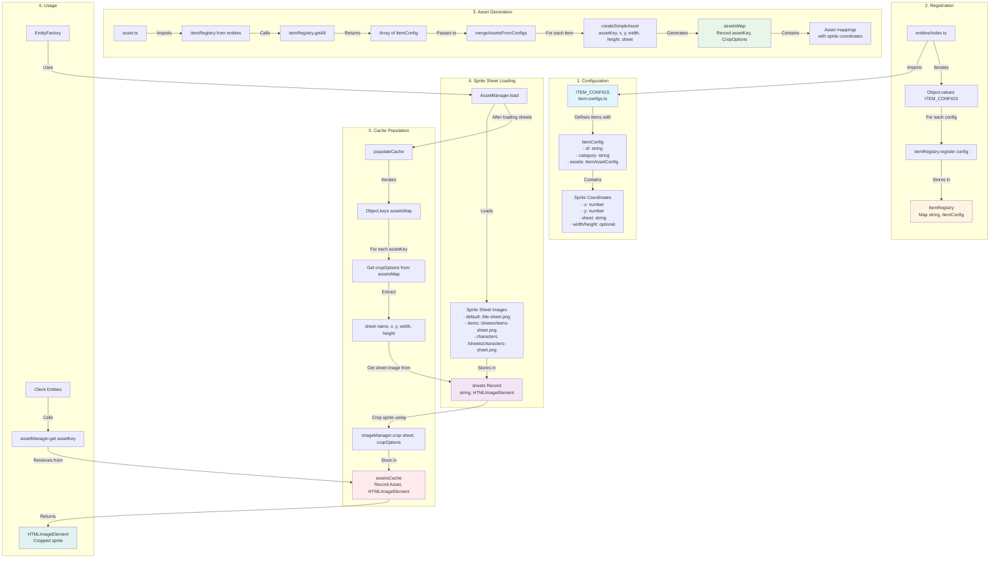

# Item Registration and Sprite Sheet Flow

## Key Components

### 1. Configuration Phase
- **ITEM_CONFIGS**: Centralized configuration object defining all items
- Each item includes sprite coordinates (x, y) and sheet name
- Example: `{ id: "bandage", assets: { x: 48, y: 48, sheet: "items" } }`

### 2. Registration Phase
- Items are registered into `itemRegistry` singleton
- Registration happens at module load time in `entities/index.ts`
- Registry stores items in a Map for fast lookup

### 3. Asset Generation Phase
- `asset.ts` automatically generates asset mappings from registered items
- Uses `createSimpleAsset()` helper to create crop options
- Builds `assetsMap` that maps asset keys to sprite coordinates

### 4. Sprite Sheet Loading Phase
- AssetManager loads sprite sheet images asynchronously
- Three sprite sheets: default, items, characters
- Sheets are stored as HTMLImageElement objects

### 5. Cache Population Phase
- After sheets are loaded, sprites are cropped and cached
- Each asset key gets its sprite cropped from the appropriate sheet
- Cached sprites are ready for immediate use

### 6. Usage Phase
- Entities use AssetManager to retrieve sprites
- `assetManager.get(assetKey)` returns the cropped sprite image
- No need to recalculate coordinates or crop on each access

